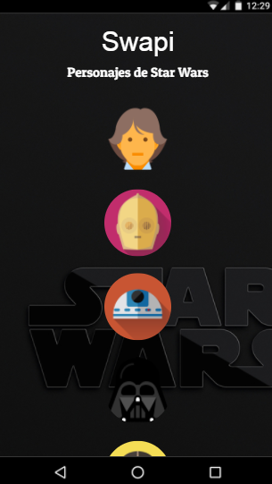
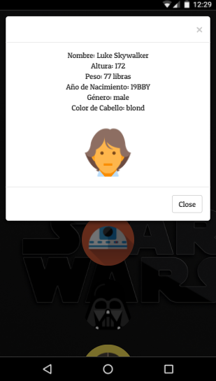

# SWAPI

1. **Objetivo del proyecto**
- Hacer una página web dónde se muestren los personajes de starwars utilizando la data de la api Swapi y mostrar sus datos en un modal.

2. **Herramientas utilizadas**

- Html5
- Css3
- Bootstrap
- Swappi api

3. **Resultados finales**

